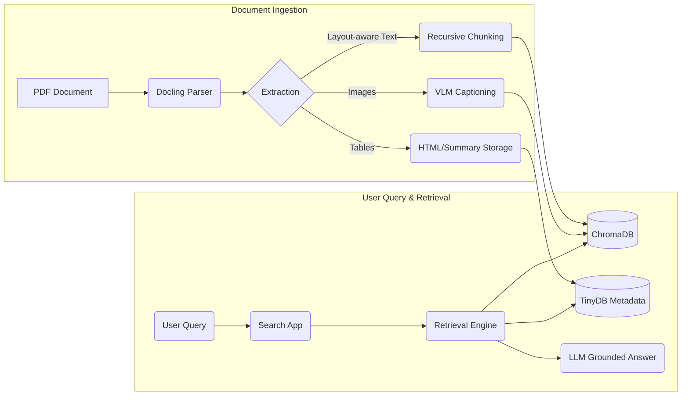

# PDF Knowledge Retrieval Tool

An enterprise-ready, local-first RAG (Retrieval-Augmented Generation) pipeline for converting complex PDFs into searchable, interactive knowledge bases. It leverages layout-aware parsing, mixed-protocol metadata storage, and advanced retrieval strategies to provide highly grounded answers from your documents.

## 🚀 Key Features

- **Structural Parsing & OCR**: Powered by [IBM's Docling](https://github.com/DS4SD/docling), extracting precise layout, tables (as HTML/JSON), and text from even scanned or complex multi-column PDFs.
- **Dual-Store Architecture**:
  - **ChromaDB**: High-performance persistent vector database for semantic chunk retrieval.
  - **TinyDB**: Lightweight metadata store for preserving document structure, HTML tables, and high-fidelity artifacts.
- **Advanced Retrieval Logic**:
  - **Dynamic Context Windows**: Automatically fetches neighboring chunks (±1) to provide context-rich grounding.
  - **Query-Aware $K$**: Adjusts retrieval depth based on query complexity (broad vs. specific).
  - **Hybrid-Ready**: Logic prepared for vector-weighted search with distance-based reranking.
- **Local Intelligence**:
  - **LLM Support**: Built-in support for `Qwen2.5-0.5B-Instruct` (Transformers) or any [Ollama](https://ollama.com/) hosted model.
  - **VLM Captioning**: Optional integration with `Florence-2` for generating detailed captions for charts and images.
- **Interactive Search Portal**: A feature-rich Streamlit UI with search history, document filtering, and real-time indexing status.
- **Production Ops**:
  - **Delta Indexing**: Uses SHA-256 hashing to prevent duplicate processing.
  - **Automated Backups**: Integrated tool for timestamped snapshots of the knowledge base.
  - **Structured Schemas**: Strict data validation using Pydantic.

## 🏗️ Architecture & Flow



## 🧠 Retrieval Intelligence

Unlike standard RAG, this tool implements several layers of retrieval logic:

1.  **Semantic Expansion**: Short queries are automatically expanded using the local LLM to include synonyms and related terms, improving hit rates for specialized terminology.
2.  **Intent Classification**: The system detects if a query is broad (e.g., "summarize") or specific (e.g., "what is the revenue") and adjusts the number of retrieved chunks ($K$) accordingly.
3.  **Section Targeting**: Integrated Regex detection prioritizes chunks associated with specific document sections (e.g., "Section 4.2") explicitly mentioned in the query.
4.  **Context Neighbors**: To solve the "sliced context" problem, the retriever fetches the immediate preceding and succeeding chunks for every semantic hit, ensuring the LLM sees the full narrative flow.

## 📂 Project Structure

```text
pdf_knowledge_tool/
├── ingest.py          # Main ingestion & processing pipeline
├── search_app.py      # Streamlit-based interactive UI
├── retrieval.py       # Core search & context expansion logic
├── models.py          # LLM/VLM interface (Transformers & Ollama)
├── config.py          # Global settings & model parameters
├── backup.py          # Data snapshot & recovery tool
├── schemas.py         # Pydantic data models
├── data/              # (Local) Persistent DBs & images
└── backups/           # (Local) Zip archives of knowledge base
```

## 🛠️ Setup & Installation

### 1. Environment Preparation
```bash
# Create and activate virtual environment
python -m venv .venv
source .venv/bin/activate  # Linux/Mac
# .venv\Scripts\activate   # Windows
```

### 2. Install Dependencies
```bash
pip install -r requirements.txt
```
*Note: For GPU acceleration, ensure you have the appropriate `torch` version for your CUDA toolkit.*

### 3. (Optional) Ollama Setup
If using the Ollama backend, ensure it is running:
```bash
ollama run qwen2.5:0.5b
```

## 💻 Usage

### Indexing a Document
Run the ingestion pipeline to process a PDF. The tool checks for duplicates automatically.
```bash
python ingest.py --pdf path/to/report.pdf --output-id marketing_q3_2024
```
*Use `--skip-vlm` if you want to skip image captioning to save memory/time.*

### Interactive Search
Launch the Streamlit interface to query your documents and upload new ones on the fly:
```bash
streamlit run search_app.py
```

### Data Management
Create a snapshot of your current state (Chroma + TinyDB):
```bash
python backup.py
```

## ⚙️ Configuration

Key settings can be adjusted in `config.py` or via environment variables:
- `LLM_BACKEND`: Switch between `transformers` (local) and `ollama`.
- `MODEL_NAME`: Defaulting to `Qwen/Qwen2.5-0.5B-Instruct` for a balance of speed and logic.
- `MAX_CONTEXT_TOKENS`: Controls the window size for RAG context (default 2000).
- `MIN_SIMILARITY_THRESHOLD`: Filters out noise from vector search.

## 🧪 Testing

The project includes a validation suite to ensure ingestion integrity:
```bash
pytest tests/test_pipeline.py
```

## 📝 License
This project is for educational and enterprise prototyping purposes. See specific licenses for [Docling](https://github.com/DS4SD/docling) and [ChromaDB](https://github.com/chroma-core/chroma) for third-party terms.

